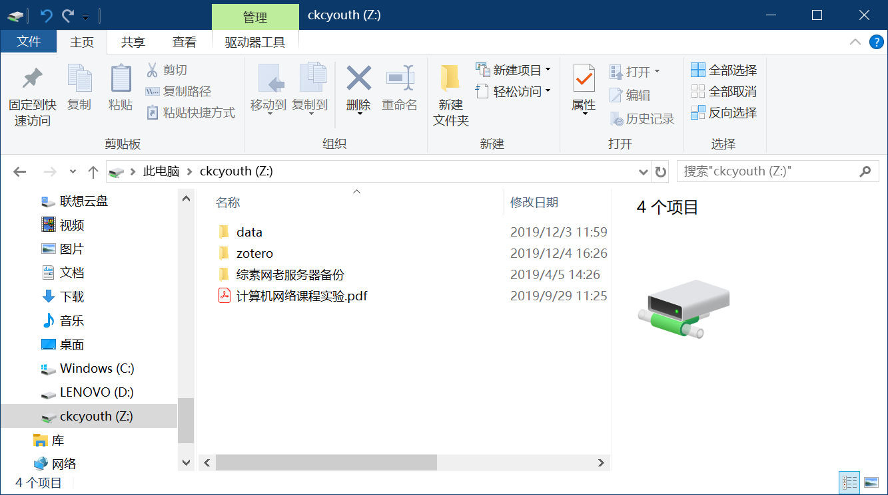
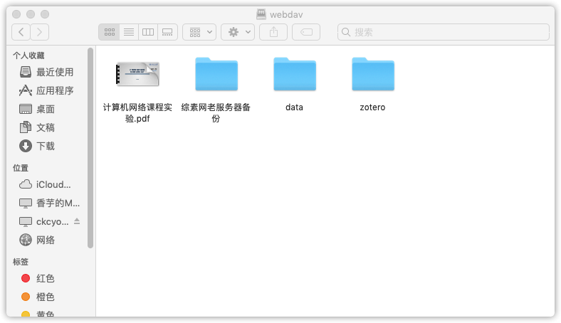
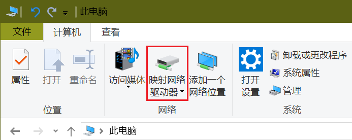
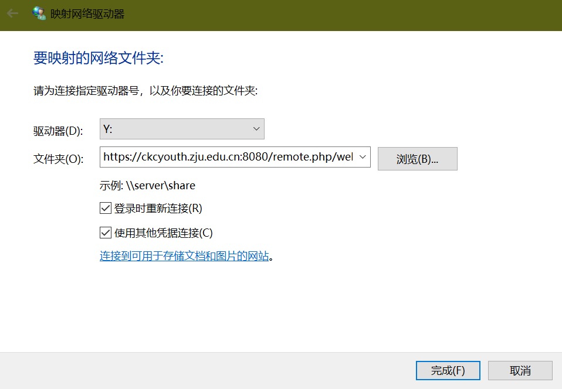
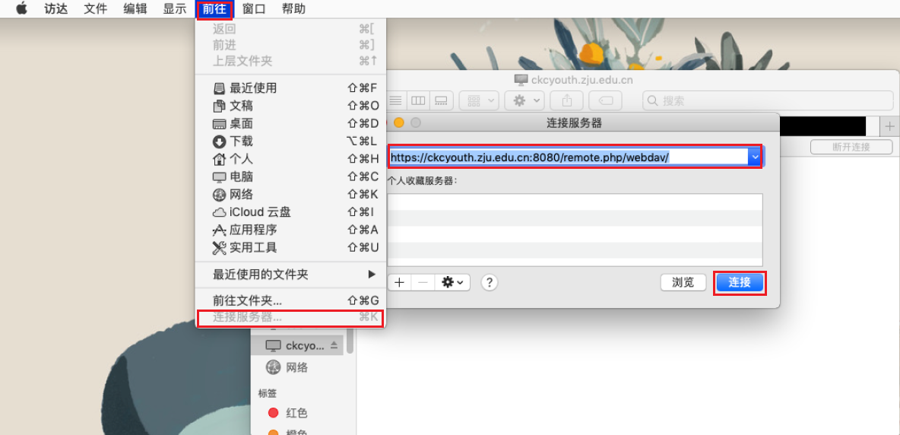
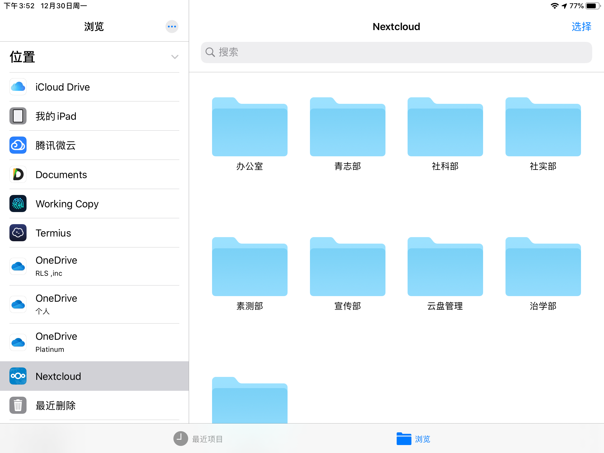
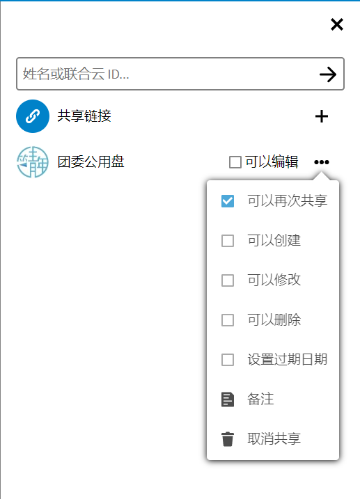

# CKCloud使用手册

v1.0

## 关于CKCloud
CKCloud是由浙江大学竺可桢学院团委宣传部搭建维护，为竺院学生提供的文件存储共享平台。云盘网址[ckcyouth.zju.edu.cn/cloud](ckcyouth.zju.edu.cn/cloud)

> 在使用过程中遇到任何问题，请联系管理员邮箱ckctw2018@163.com

## 账号
可由管理员添加或用ZJU邮箱自行注册。使用时请遵守法律法规。

### 注册
- 注册后将会向您的邮箱发送确认链接以确保是您本人，请注意可能在您的垃圾邮件箱中。
- 通过邮件链接确认后需要等待管理员审核，一般为1-2个工作日。审核通过后可能通过邮件通知您。
- 然后您可以开始使用。在此之前，尝试登录将给出错误提示。

### 存储空间配额

团委内部公用账号容量不限，个人账号默认配额50GB，如有需求请邮件联系管理员进行扩容。

### 账号回收

个人账号在本科毕业后视情况可能进行回收，如需保留请邮件联系管理员。在特殊情况下管理员可能有权删除您的账号（将会提前通知）。

## 挂载为本地磁盘
浏览器上下载文件不稳定，可将网盘挂载为本地磁盘，通过文件系统访问（需要连接网络）。

    
    

> Webdav连接地址（直接打开无效）：https://ckcyouth.zju.edu.cn:8080/remote.php/webdav/

### Windows10
计算机>右键>映射网络驱动器>键入地址 >勾选“使用其他凭据连接” >输入用户名密码。  

	
    
步骤1 映射网络驱动器

    
    
步骤2 连接

### MacOS
访达>前往>连接服务器>键入地址>点击连接>输入用户名密码。

## 移动端
IOS与Android用户推荐使用nextcloud APP,可在应用商店搜索下载。

## 共享
支持链接共享文件/文件夹，可设置密码/过期时间/下载上传权限，用于文件分享下载、文件收集等。

## 注意
- 通过网页上载文件大小限制为20GB，大量文件或极大文件可能出现中断。
- 受限于服务器性能，访问人数较多时网页响应速度较慢，建议通过客户端或者磁盘挂载方式使用。
